 

## Sobre mim

Sou **Analista Administrativo de Vendas** em uma concessionária Honda, em Recife, e estudo **Análise e Desenvolvimento de Sistemas** na FBV Wyden. No dia a dia lido com dados de vendas, controle de entrada e saída de veículos e conferência de informações. Estou transformando essa vivência em carreira de **Dados**: SQL, Python, Power BI e, mais adiante, Engenharia de Dados.

Minha base é o desenvolvimento web (HTML, CSS, JavaScript, Node.js, Express, TypeScript, React e Tailwind). Por isso consigo fazer o caminho inteiro: **modelar o banco, escrever a consulta, expor a API e construir o painel** em que a resposta aparece.

- 📊 **Foco:** Análise de Dados com SQL, Python (Pandas e NumPy) e Power BI
- ⚙️ **Diferencial:** Backend com Node.js, Express e TypeScript
- 🤖 **Em estudo:** automação e IA aplicada (APIs de LLM, tool calling)
- 🐳 **Infra:** Docker nos projetos, AWS em aprendizado

## Stack

## Projeto em destaque: Painel de Vendas Honda

  

Projeto **real, pedido no meu trabalho e em uso em algumas concessionárias Honda de Recife**. O repositório é a versão reconstruída para portfólio, com dados 100% fictícios e sem nenhuma informação da empresa.

- **Banco:** modelagem relacional no PostgreSQL, com chaves, views e índices, e agregações escritas em SQL, sem ORM
- **API:** REST em Node.js, Express e TypeScript, com validação e tratamento central de erros
- **Painel:** filtro por loja, metas, ranking de vendedores, mix de modelos e calendário de vendas
- **Detalhes que importam:** fuso horário tratado no banco e gerente derivado do vendedor, para evitar erro de cadastro

[▶ Abrir a demo online](https://diegosantiago1.github.io/Portifolio/projetos/painel-vendas/) · [📂 Ver o repositório](https://github.com/DiegoSantiago1/analise-vendas-concessionaria) · [🌐 Ver no portfólio](https://diegosantiago1.github.io/Portifolio/#projetos)

## Atividade

  

## Próximos projetos

- 📦 **Estoque e Logística:** SQL e Pandas sobre movimentação de veículos
- 👥 **Customer Analytics:** segmentação RFM, churn e valor do cliente
- 🔄 **Data Platform:** pipeline de dados com Docker e AWS
- 🤖 **AI Business Analyst:** LLM consultando o banco com tool calling e limites de segurança

---

Aberto a conversar sobre oportunidades em **Análise de Dados** e **Backend**.

