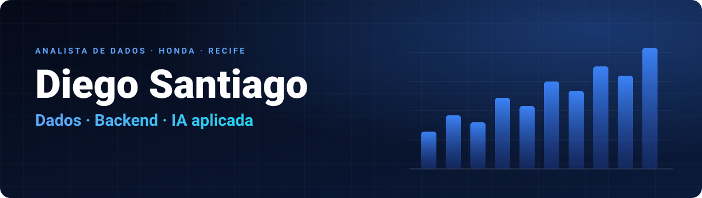
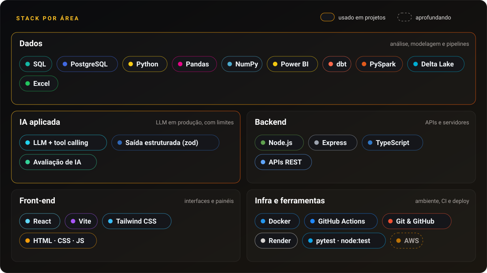
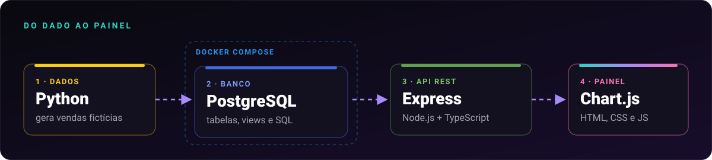

 

## Sobre mim

Sou **Analista de Dados I** na Autoline Honda, em Recife, e estudo **Análise e Desenvolvimento de Sistemas** na FBV Wyden. No dia a dia trabalho com dados de vendas, controle de entrada e saída de veículos e conferência de informações, e desenvolvi o painel de vendas que hoje está em uso em concessionárias Honda de Recife. Meu foco é **Dados** (SQL, Python, Power BI, dbt) e **Engenharia de Dados** (PySpark, Delta Lake, pipelines idempotentes).

Minha base é o desenvolvimento web (HTML, CSS, JavaScript, Node.js, Express, TypeScript, React e Tailwind). Por isso consigo fazer o caminho inteiro: **modelar o banco, escrever a consulta, expor a API e construir o painel** em que a resposta aparece.

- 📊 **Foco:** Análise de Dados com SQL, Python (Pandas e NumPy) e Power BI
- ⚙️ **Diferencial:** Backend com Node.js, Express e TypeScript
- 🤖 **IA aplicada:** LLM com tool calling, saída estruturada e avaliação de respostas (Projeto 5, no ar)
- 🐳 **Infra:** Docker, GitHub Actions e deploy no Render; AWS em aprendizado

## Stack

## Projeto em destaque: Painel de Vendas Honda

  

Projeto **real, pedido no meu trabalho e em uso em algumas concessionárias Honda de Recife**. O repositório é a versão reconstruída para portfólio, com dados 100% fictícios e sem nenhuma informação da empresa.

- **Banco:** modelagem relacional no PostgreSQL, com chaves, views e índices, e agregações escritas em SQL, sem ORM
- **API:** REST em Node.js, Express e TypeScript, com validação e tratamento central de erros
- **Painel:** filtro por loja, metas, ranking de vendedores, mix de modelos e calendário de vendas
- **Detalhes que importam:** fuso horário tratado no banco e gerente derivado do vendedor, para evitar erro de cadastro

## Controle de Materiais e Cautela

  

Projeto **real**: desenvolvi o **sistema de controle de cautelas** da seção de material em que trabalhei na **Força Aérea**, que segue em uso, e os relatórios de estoque apresentados nas reuniões com os superiores. O repositório é a versão reconstruída para portfólio, com dados 100% fictícios e sem nenhuma informação da organização.

- **Banco:** PostgreSQL com as regras de negócio em funções, histórico de movimentações imutável e concorrência tratada (`FOR UPDATE SKIP LOCKED`)
- **Análises:** conferência de planilha, atrasos, ociosidade e ruptura de estoque, em SQL (CTEs, window functions) e Python (Pandas)
- **Power BI:** dois relatórios em modelo estrela, versionados como código (PBIP), com cada número conferido contra o SQL
- **Sistema web:** retirada, devolução, posse e estoque, com perfis de acesso, auditoria e 700+ testes automatizados

## Customer Analytics: Varejo Online

  

**Dados reais e públicos** de uma loja online do Reino Unido que vende presentes e utilidades, com muitos clientes lojistas: 1 milhão de linhas de vendas em dois anos (UCI Online Retail II). Respondi as quatro perguntas de um time de CRM e **conferi cada resposta contra o que de fato aconteceu depois**.

- **Melhores clientes:** segmentação RFM em SQL. Os Campeões são 24% dos clientes e trazem 69% da receita
- **Quem está indo embora:** regra de churn testada numa data passada. 1.376 clientes em risco, com £838 mil de receita no último ano, e quase metade disso está em clientes leais que pararam
- **Retenção e valor do cliente:** coortes com window functions e CLV de 6 meses, que ganhou de um modelo ingênuo sazonal
- **Engenharia:** limpeza e análise em SQL versionado no PostgreSQL, 18 checagens de qualidade, 280 testes e Power BI com cada número conferido contra o SQL

## Pipeline das Bicicletas de Londres

  

**Dados reais e públicos** das bicicletas de Londres (TfL Santander Cycles), num pipeline em que **o dado não para de chegar**: onde as estações ficam vazias ou cheias, quando, e onde a operação deve agir primeiro.

- **Coleta ao vivo:** as cerca de 800 estações a cada 15 minutos, com o dado bruto guardado intocado e um registro de cada execução
- **Carga incremental:** 41 milhões de viagens em 148 arquivos com 6 formatos de cabeçalho, lidas pelo nome da coluna; rodar duas vezes não duplica
- **dbt:** 17 modelos e 47 testes; demanda perdida estimada por estação e hora
- **Todo dia:** o banco é recriado do zero no GitHub Actions e a página se atualiza sozinha, com a saúde do próprio pipeline

## AI Business Analyst

  

**IA aplicada a dados:** o gerente de uma rede de concessionárias pergunta em português e um LLM com **tool calling** consulta o PostgreSQL **só para leitura**, respondendo com números conferíveis, cada um com o SQL que o gerou (dados 100% fictícios).

- **Métricas oficiais:** a IA escolhe a métrica e a API monta SQL parametrizado; o SQL livre é só reserva
- **Segurança em 4 camadas:** o usuário da IA só tem SELECT em 7 views; ataques testados um a um
- **Avaliação:** 36 perguntas com resposta certa conhecida, incluindo pedidos hostis e injeção pelo dado
- **Números conferidos:** cada valor citado é procurado no resultado do banco; o que a IA calculou sozinha é marcado

## Lakehouse do Financiamento Imobiliário (EUA)

  

**Engenharia de dados com dados reais e públicos do governo dos EUA (HMDA):** 222,7 milhões de pedidos de financiamento imobiliário de 2018 a 2025, num lakehouse em **PySpark + Delta Lake**. Quem consegue financiar a casa, e quanto o próprio dado do governo muda entre as versões que ele publica.

- **Bronze → silver → gold:** carga idempotente (SHA-256 e `replaceWhere`), CHECK constraints e `RESTORE` se a contagem não bate; nenhuma linha perdida
- **Versões sem chave:** o governo publica cada ano 3 vezes e o dado não tem ID do empréstimo; comparo como multiconjuntos por hash, provado contra o `exceptAll` do Spark
- **Conferido contra o governo:** estado × resultado na API oficial e registros por banco; taxas de negativa a 0,06 p.p. do relatório do CFPB
- **Achados:** o refinanciamento caiu 98% com a alta dos juros de 2022; ~5% das linhas mudam entre versões, mas as métricas nacionais quase não

## Atividade

  

---

Aberto a conversar sobre oportunidades em **Análise de Dados** e **Backend**.

